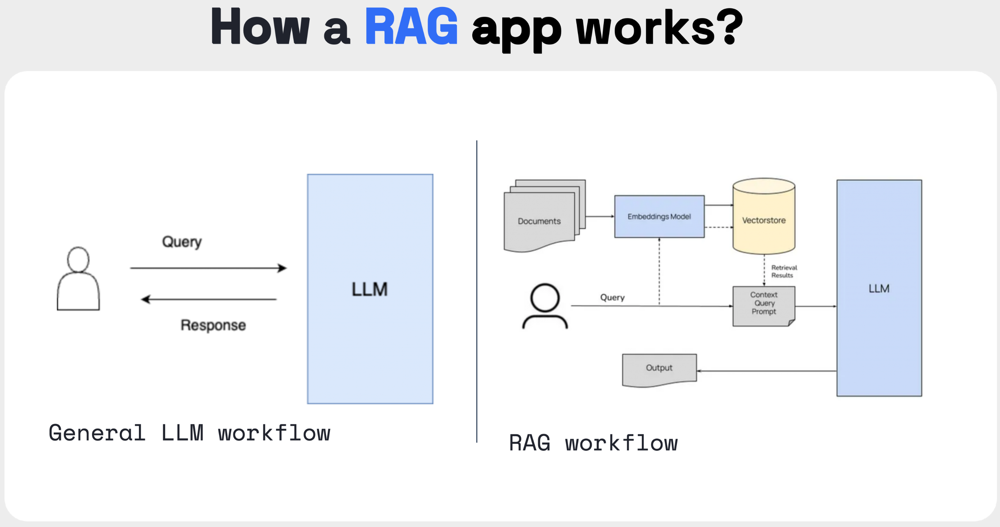

# Mintair LLM Agent powered by GaiaNet with RAG

This project leverages **GaiaNet** to build a **Retrieval Augmented Generation (RAG)**-based Large Language Model (LLM) agent for **Mintair**, a platform offering decentralized node services to support various blockchain networks. By utilizing GaiaNet’s advanced retrieval capabilities, this agent is designed to accurately address questions related to Mintair's infrastructure, service offerings, and node deployment strategies.

You can access the project through the link [https://0x1a955e36edabbeab1498c05a3324423fcd60c07f.us.gaianet.network](https://0x1a955e36edabbeab1498c05a3324423fcd60c07f.us.gaianet.network).

Mintair specializes in providing infrastructure for decentralized networks, enabling developers and businesses to scale blockchain projects effectively. You can learn more about Mintair from its official documentation [here](https://mirror.xyz/0x878E5F1453003cFa4d684701745feD5d563fFF77).

**Retrieval Augmented Generation (RAG)** is a framework designed to mitigate the hallucination problem of LLMs by integrating external, domain-specific resources. This project setup involves the following components:

- A regular LLM
- An embedding model
- A vector database
- An API server application



## Project Highlights

By leveraging GaiaNet’s decentralized knowledge graph, this project addresses several key issues in traditional LLM agents:

- **Accurate retrieval of Mintair-specific knowledge**: Reduces hallucinations by retrieving real-time, verified information from Mintair’s official documentation.
- **Scalability and flexibility**: GaiaNet’s decentralized infrastructure allows the LLM agent to scale with increasing queries while maintaining domain-specific accuracy.
- **Personalization**: The LLM agent is tailored for Mintair, ensuring users receive responses related to node services, blockchain infrastructure, and network scaling.

## Why GaiaNet?

GaiaNet offers several advantages for building and deploying LLM agents:

1. **Decentralization**: GaiaNet ensures robust access to various knowledge sources without relying on centralized control, reducing the risk of data unavailability.
2. **Scalability**: With GaiaNet’s distributed nodes, the solution can handle growing knowledge bases and increasing queries without compromising on performance.
3. **Customizability**: GaiaNet allows developers to integrate specific knowledge bases, such as Mintair’s node service details and architecture.
4. **Seamless integration with RAG**: GaiaNet is optimized for retrieval-augmented generation, enabling efficient use of external data sources in LLM responses.

## Implementation Steps

### 1. Set up a GaiaNet Node
Start by setting up a GaiaNet node on your local machine or server. Follow the official [Quick start with GaiaNet Node](https://docs.gaianet.ai/node-guide/quick-start) to get started.

### 2. Crawl Mintair Data Using [Firecrawl](https://www.firecrawl.dev/)

Next, use **Firecrawl** to gather Mintair’s documentation and create markdown files for ingestion:

- Install and set up Firecrawl locally by following the instructions on its [GitHub repository](https://github.com/mendableai/firecrawl/tree/main).
- Use Firecrawl to crawl Mintair’s official documentation and save the output as markdown. Example command:

  ```bash
  # Clone the Firecrawl repository
  git clone https://github.com/mendableai/firecrawl.git
  cd firecrawl

  # Install dependencies
  npm install

  # Start the Firecrawl service
  npm run start

  # Use Firecrawl to crawl Mintair's documentation
  curl -X POST -H "Content-Type: application/json" \
    -d '{"url": "https://mirror.xyz/0x878E5F1453003cFa4d684701745feD5d563fFF77", "outputFormat": "markdown"}' \
    http://localhost:4000/api/crawl
  ```

This command will generate markdown files containing Mintair’s official documentation.

### 3. Convert Markdown to [Snapshot](https://docs.gaianet.ai/creator-guide/knowledge/markdown)

After obtaining the markdown files from Firecrawl, you need to convert them into a vector snapshot:

```bash
wasmedge --dir .:. \
  --nn-preload embedding:GGML:AUTO:nomic-embed-text-v1.5.f16.gguf \
  markdown_embed.wasm embedding default 768 mintair-docs.md --heading_level 2 --ctx_size 4096 --maximum_context_length 2048
```

This command creates vector embeddings for the Mintair documentation.

### 4. [Customize Node Configuration](https://docs.gaianet.ai/node-guide/customize)

Next, update the GaiaNet node configuration to include the Mintair snapshot you generated in the previous step. This ensures the LLM retrieves information directly from the Mintair knowledge base.

```bash
gaianet config \
  --rag-policy last-user-message \
  --embedding-batch-size 8192 \
  --chat-url https://huggingface.co/gaianet/gemma-2-9b-it-GGUF/blob/main/gemma-2-9b-it-Q5_K_M.gguf \
  --chat-ctx-size 4096 \
  --prompt-template gemma-instruct

gaianet config \
  --snapshot https://huggingface.co/datasets/Gavin2015/Mintair/resolve/main/mintair-88687038271388-2024-09-30-13-25-46.snapshot \
  --system-prompt "You are a helpful, respectful, and honest Mintair assistant. You're an expert in node services and decentralized network infrastructure, and you always answer questions with clarity." \
  --rag-prompt "You're an expert in Mintair node services and decentralized network infrastructure. Use the following context to answer the user's question.\n"
```

### 5. Validate the Model

Finally, validate the LLM agent by querying it about Mintair’s node services, infrastructure, and other specific topics to ensure accurate retrieval and responses from the knowledge base.

You can test the agent by interacting with the API server and checking the responses against Mintair's documentation.